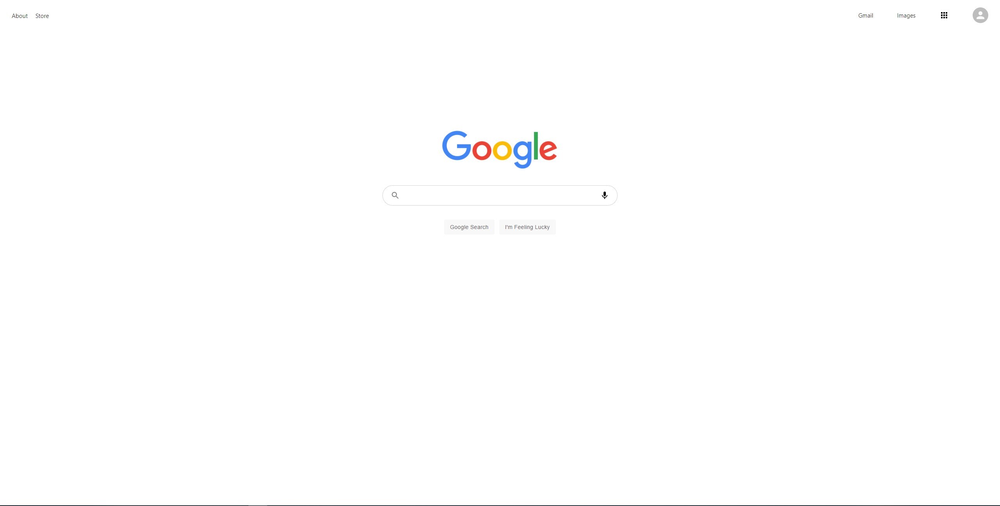
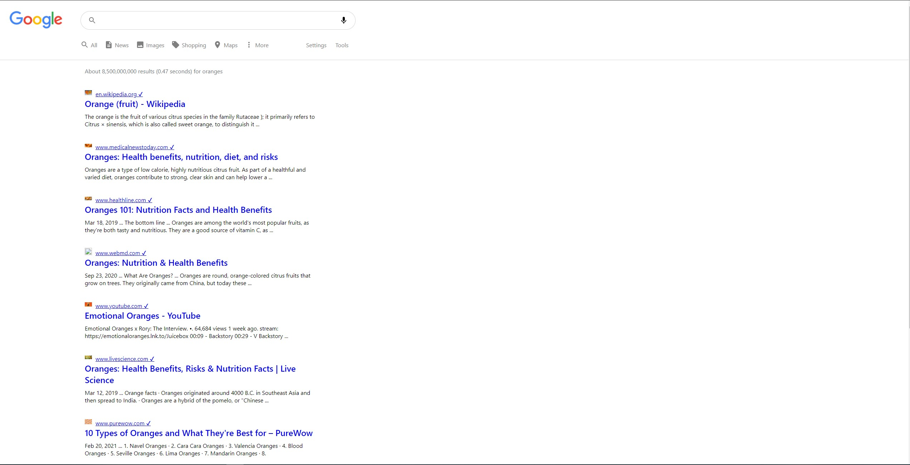

# Google-clone

This project was inpired by "Clever Programmer" tutorials on youtube. 

### Disclaimer
This is only for educational purposes. Google.con is property of Google Inc.

## Here is the [Deployed App](https://clone-816d9.web.app/).

## Set-Up

### Packages Used
npm install react-router-dom
npm install @material-ui/core
npm install @material-ui/icons
npm create-react-app

### Pushing To Repository
git remote add origin < url>
git branch -M main
git push -u origin main

### Deployment to Firebase
In Firebase create a new app
npm install -g firebase-tools
firebase login
firebase init
Choose: " Hosting: Configure and deploy Firebase Hosting sites "
Choose: " Use an existing project " if you created an app previously.
What do you want to use as your public directory?
	Press enter
	It will default to public
	
Configure as a single-page app (rewrite all urls to /index.html)? Yes.
Set up automatic builds and deploys with GitHub? No
firebase deploy

## Search 

## Results

